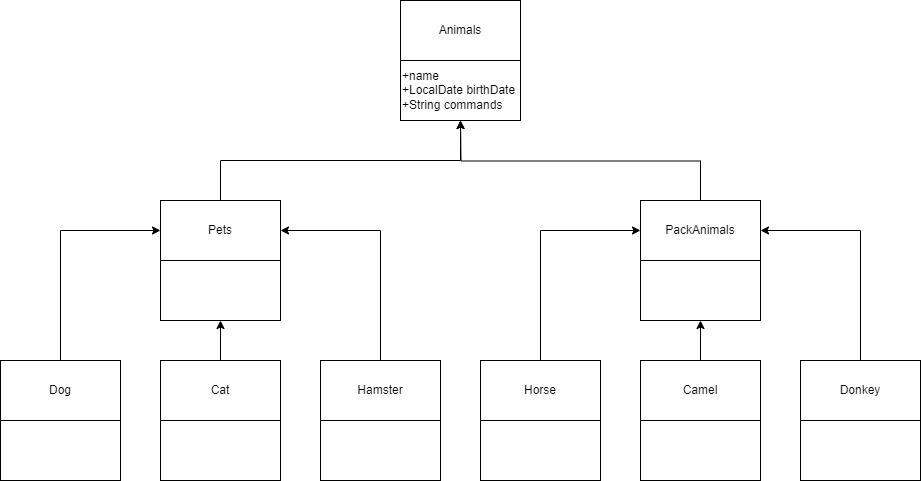
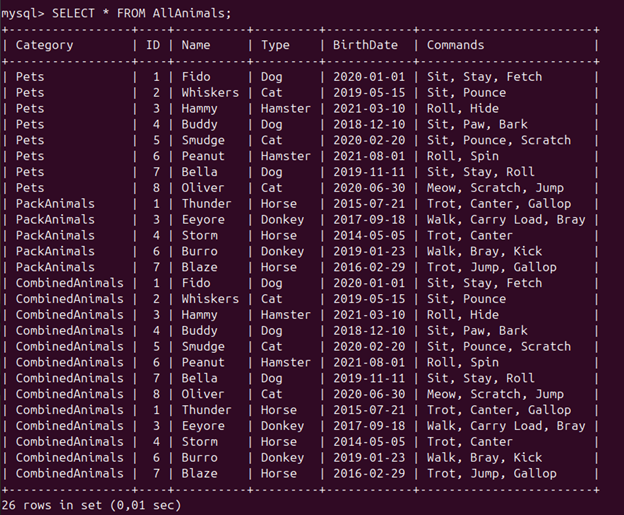

# **Итоговая контрольная работа**

 

 **Информация о проекте**

 Необходимо организовать систему учета для питомника в котором живут домашние и Pack animals.

 

**Как сдавать проект**

 

Для сдачи проекта необходимо создать отдельный общедоступный репозиторий(Github, gitlub, или Bitbucket). Разработку вести в этом репозитории, использовать пул реквесты на изменения. Программа должна запускаться и работать, ошибок при выполнении программы быть не должно. Программа, может использоваться в различных системах, поэтому необходимо разработать класс в виде конструктора

 

# **Задание**

 

**Операционные системы и виртуализация (Linux)**

 

1\. Использование команды cat в Linux

   \- Создать два текстовых файла: "Pets"(Домашние животные) и "Pack animals"(вьючные животные), используя команду \`cat\` в терминале Linux. В первом файле перечислить собак, кошек и хомяков. Во втором — лошадей, верблюдов и ослов.

   \- Объединить содержимое этих двух файлов в один и просмотреть его содержимое.

   \- Переименовать получившийся файл в "Human Friends"(.

Пример конечного вывода после команды “ls” :

Desktop Documents Downloads  HumanFriends.txt  Music  PackAnimals.txt  Pets.txt  Pictures  Videos

 

2\. Работа с директориями в Linux

   \- Создать новую директорию и переместить туда файл "Human Friends".

 

3\. Работа с MySQL в Linux. “Установить MySQL на вашу вычислительную машину ”

   \- Подключить дополнительный репозиторий MySQL и установить один из пакетов из этого репозитория.

 

4\. Управление deb-пакетами

   \- Установить и затем удалить deb-пакет, используя команду \`dpkg\`.

 

5\. История команд в терминале Ubuntu

   \- Сохранить и выложить историю ваших терминальных команд в Ubuntu.

В формате: Файла с ФИО, датой сдачи, номером группы(или потока)

 

**Объектно-ориентированное программирование**

 

6\. Диаграмма классов

   \- Создать диаграмму классов с родительским классом "Животные", и двумя подклассами: "Pets" и "Pack animals".

В составы классов которых в случае Pets войдут классы: собаки, кошки, хомяки, а в класс Pack animals войдут: Лошади, верблюды и ослы).

Каждый тип животных будет характеризоваться (например, имена, даты рождения, выполняемые команды и т.д)

Диаграмму можно нарисовать в любом редакторе, такими как Lucidchart, Draw.io, Microsoft Visio и других.

 

7\. Работа с MySQL (Задача выполняется в случае успешного выполнения задачи “Работа с MySQL в Linux. “Установить MySQL на вашу машину”

 

7.1. После создания диаграммы классов в 6 пункте, в 7 пункте база данных "Human Friends" должна быть структурирована в соответствии с этой диаграммой. Например, можно создать таблицы, которые будут соответствовать классам "Pets" и "Pack animals", и в этих таблицах будут поля, которые характеризуют каждый тип животных (например, имена, даты рождения, выполняемые команды и т.д.).

7.2   \- В ранее подключенном MySQL создать базу данных с названием "Human Friends".

   \- Создать таблицы, соответствующие иерархии из вашей диаграммы классов.

   \- Заполнить таблицы данными о животных, их командах и датами рождения.

   \- Удалить записи о верблюдах и объединить таблицы лошадей и ослов.

   \- Создать новую таблицу для животных в возрасте от 1 до 3 лет и вычислить их возраст с точностью до месяца.

   \- Объединить все созданные таблицы в одну, сохраняя информацию о принадлежности к исходным таблицам.

 

Пример заполненной таблицы для теста:

Лист "Pets"

| ID | Name | Type | BirthDate | Commands |
| ----- | ----- | ----- | ----- | ----- |
| 1 | Fido | Dog | 2020-01-01 | Sit, Stay, Fetch |
| 2 | Whiskers | Cat | 2019-05-15 | Sit, Pounce |
| 3 | Hammy | Hamster | 2021-03-10 | Roll, Hide |
| 4 | Buddy | Dog | 2018-12-10 | Sit, Paw, Bark |
| 5 | Smudge | Cat | 2020-02-20 | Sit, Pounce, Scratch |
| 6 | Peanut | Hamster | 2021-08-01 | Roll, Spin |
| 7 | Bella | Dog | 2019-11-11 | Sit, Stay, Roll |
| 8 | Oliver | Cat | 2020-06-30 | Meow, Scratch, Jump |

 

 Лист "PackAnimals"

| ID | Name | Type | BirthDate | Commands |
| ----- | ----- | ----- | ----- | ----- |
| 1 | Thunder | Horse | 2015-07-21 | Trot, Canter, Gallop |
| 2 | Sandy | Camel | 2016-11-03 | Walk, Carry Load |
| 3 | Eeyore | Donkey | 2017-09-18 | Walk, Carry Load, Bray |
| 4 | Storm | Horse | 2014-05-05 | Trot, Canter |
| 5 | Dune | Camel | 2018-12-12 | Walk, Sit |
| 6 | Burro | Donkey | 2019-01-23 | Walk, Bray, Kick |
| 7 | Blaze | Horse | 2016-02-29 | Trot, Jump, Gallop |
| 8 | Sahara | Camel | 2015-08-14 | Walk, Run |

 

 

 

 

8\. ООП и Java

   Создать иерархию классов в Java, который будет повторять диаграмму классов созданную в задаче 6(Диаграмма классов) .

 

9\. Программа-реестр домашних животных

	Написать программу на Java, которая будет имитировать реестр домашних животных.

Должен быть реализован следующий функционал:

	

	9.1. Добавление нового животного

    	Реализовать функциональность для добавления новых животных в реестр.      

 Животное должно определяться в правильный класс (например, "собака", "кошка", "хомяк" и т.д.)

    	

 

   9.2. Список команд животного

    	\- Вывести список команд, которые может выполнять добавленное животное (например, "сидеть", "лежать").

    	

	9.3. Обучение новым командам

    	\- Добавить возможность обучать животных новым командам.

  9.4 Вывести список животных по дате рождения

 

9.5. Навигация по меню

    	\- Реализовать консольный пользовательский интерфейс с меню для навигации между вышеуказанными функциями.

    	

10\. Счетчик животных

Создать механизм, который позволяет вывести на экран общее количество созданных животных любого типа (Как домашних, так и вьючных), то есть при создании каждого нового животного счетчик увеличивается на “1”.

   
# Решение:

## 1-2 Linux
```

 gb@gb-linux:~$ mkdir final_work
 
 gb@gb-linux:~$ cd final_work/

 gb@gb-linux:~/final_work$ cat > Pets.txt

 Dogs

 Cats

 Hamsters

 gb@gb-linux:~/final_work$ cat > PackAnimals.txt

 Horses

 Camels

 Donkeys

 gb@gb-linux:~/final_work$ cat Pets.txt PackAnimals.txt > Animals.txt

 gb@gb-linux:~/final_work$ cat Animals.txt

 Dogs

 Cats

 Hamsters

 Horses

 Camels

 Donkeys

 gb@gb-linux:~/final_work$ mv Animals.txt HumanFriends.txt

 gb@gb-linux:~/final_work$ ls

 HumanFriends.txt  PackAnimals.txt  Pets.txt  

 gb@gb-linux:~/final_work$ mkdir PetsDirectory

 gb@gb-linux:~/final_work$ mv HumanFriends.txt PetsDirectory/

 gb@gb-linux:~/final_work$ cd PetsDirectory/

 gb@gb-linux:~/final_work/PetsDirectory$ ls

 HumanFriends.txt
```
## 3 Работа с MySQL в Linux  
```
gb@gb-linux:~/final_work$ sudo apt install mysql-server

[sudo] пароль для gb:

Чтение списков пакетов… Готово

Построение дерева зависимостей… Готово

Чтение информации о состоянии… Готово 

Следующий пакет устанавливался автоматически и больше не требуется:

   ubuntu-fan

gb@gb-linux:~/final_work$ sudo service mysql status
```
## 4 Управление deb-пакетами
```
gb@gb-linux:~/final_work$ sudo apt-get install cowsay

Чтение списков пакетов… Готово

Построение дерева зависимостей… Готово

Чтение информации о состоянии… Готово    	 

Предлагаемые пакеты:

  filters cowsay-off

Следующие НОВЫЕ пакеты будут установлены:

  cowsay

Обновлено 0 пакетов, установлено 1 новых пакетов, для удаления отмечено 0 пакетов, и 31 пакетов не обновлено.

Необходимо скачать 0 B/18,6 kB архивов.

После данной операции объём занятого дискового пространства возрастёт на 93,2 kB.

Выбор ранее не выбранного пакета cowsay.

(Чтение базы данных … на данный момент установлено 151266 файлов и каталогов.)

Подготовка к распаковке …/cowsay\_3.03+dfsg2-8\_all.deb …

Распаковывается cowsay (3.03+dfsg2-8) …

Настраивается пакет cowsay (3.03+dfsg2-8) …

Обрабатываются триггеры для man-db (2.10.2-1) …

gb@gb-linux:~/final_work$ cowsay "Hello"

 _______

< Hello >

  - - - - - - -

    	\   ^__^

     	  \  (oo)\_______

        	 (__)\       )\/\

            	 ||----w |

            	 || 	||

gb@gb-linux:~/final_work$ sudo apt-get remove cowsay

Чтение списков пакетов… Готово

Построение дерева зависимостей… Готово

Чтение информации о состоянии… Готово    	 

Следующие пакеты будут УДАЛЕНЫ:

  cowsay

Обновлено 0 пакетов, установлено 0 новых пакетов, для удаления отмечено 1 пакетов, и 31 пакетов не обновлено.

После данной операции объём занятого дискового пространства уменьшится на 93,2 kB.

Хотите продолжить? [Д/н] Д

(Чтение базы данных … на данный момент установлено 151326 файлов и каталогов.)

Удаляется cowsay (3.03+dfsg2-8) …

Обрабатываются триггеры для man-db (2.10.2-4build2) …
```
## 5 История команд в терминале Ubuntu  
``` 
gb@gb-linux:~/final_work/PetsDirectory$ history > history.txt

 288  mkdir final_work

 289  cd final_work/

 290  cat > Pets.txt

 291  cat > Pack_animals.txt

 292  cat Pets.txt PackAnimals.txt > Animals.txt

 293  cat Animals.txt

 294  mv Animals.txt HumanFriends.txt

 295  ls

 296  mkdir PetsDirectory

 297  mv HumanFriends.txt PetsDirectory/

 298  cd PetsDirectory/

 299  ls

 300  sudo apt-get intstall mysql-server

 301  sudo apt-get install mysql-server

 302  mysql --version

 303  sudo apt-get install cowsay

 304  cowsay "Hello"

 305  sudo apt-get remove cowsay

 306  cowsay "Hello"

 307  history > history.txt
```
## 6 Диаграмма классов



## 7 Работа с MySQL 
```
gb@gb-linux:~$ sudo mysql

mysql> CREATE DATABASE HumanFriends;

Query OK, 1 row affected (0,07 sec)

mysql> USE HumanFriends;

Database changed

mysql>	CREATE TABLE Pets (

	->    	ID INT AUTO_INCREMENT PRIMARY KEY,

	->    	Name VARCHAR(50),

	->    	Type VARCHAR(20),

	->    	BirthDate DATE,

	->    	Commands TEXT

	->	);

Query OK, 0 rows affected (1,05 sec)

mysql>	CREATE TABLE PackAnimals (

	->    	ID INT AUTO_INCREMENT PRIMARY KEY,

	->    	Name VARCHAR(50),

	->    	Type VARCHAR(20),

	->    	BirthDate DATE,

	->    	Commands TEXT

	->	);

Query OK, 0 rows affected (0,12 sec)

mysql> INSERT INTO Pets (Name, Type, BirthDate, Commands) VALUES

	-> ('Fido', 'Dog', '2020-01-01', 'Sit, Stay, Fetch'),

	-> ('Whiskers', 'Cat', '2019-05-15', 'Sit, Pounce'),

	-> ('Hammy', 'Hamster', '2021-03-10', 'Roll, Hide'),

	-> ('Buddy', 'Dog', '2018-12-10', 'Sit, Paw, Bark'),

	-> ('Smudge', 'Cat', '2020-02-20', 'Sit, Pounce, Scratch'),

	-> ('Peanut', 'Hamster', '2021-08-01', 'Roll, Spin'),

	-> ('Bella', 'Dog', '2019-11-11', 'Sit, Stay, Roll'),

	-> ('Oliver', 'Cat', '2020-06-30', 'Meow, Scratch, Jump');

Query OK, 8 rows affected (0,25 sec)

Records: 8  Duplicates: 0  Warnings: 0

mysql> INSERT INTO PackAnimals (Name, Type, BirthDate, Commands) VALUES

	-> ('Thunder', 'Horse', '2015-07-21', 'Trot, Canter, Gallop'),

	-> ('Sandy', 'Camel', '2016-11-03', 'Walk, Carry Load'),

	-> ('Eeyore', 'Donkey', '2017-09-18', 'Walk, Carry Load, Bray'),

	-> ('Storm', 'Horse', '2014-05-05', 'Trot, Canter'),

	-> ('Dune', 'Camel', '2018-12-12', 'Walk, Sit'),

	-> ('Burro', 'Donkey', '2019-01-23', 'Walk, Bray, Kick'),

	-> ('Blaze', 'Horse', '2016-02-29', 'Trot, Jump, Gallop'),

	-> ('Sahara', 'Camel', '2015-08-14', 'Walk, Run');

Query OK, 8 rows affected (0,13 sec)

Records: 8  Duplicates: 0  Warnings: 0

mysql> DELETE FROM PackAnimals WHERE Type = 'Camel';

Query OK, 3 rows affected (0,01 sec)

mysql> CREATE TABLE CombinedAnimals AS

	-> SELECT * FROM Pets

	-> UNION ALL

	-> SELECT * FROM PackAnimals;

Query OK, 13 rows affected (0,27 sec)

Records: 13  Duplicates: 0  Warnings: 0

mysql> CREATE TABLE YoungAnimals AS

	-> SELECT

	-> 	ID,

	-> 	Name,

	-> 	Type,

	-> 	BirthDate,

	-> 	Commands,

	-> 	FLOOR(DATEDIFF(CURDATE(), BirthDate)/30) AS AgeInMonths

	-> FROM

	-> CombinedAnimals

	-> WHERE

	-> DATEDIFF(CURDATE(), BirthDate) BETWEEN 365 AND 1095;

Query OK, 0 rows affected (0,21 sec)

Records: 0  Duplicates: 0  Warnings: 0

mysql> CREATE TABLE AllAnimals AS

	-> SELECT

	-> 'Pets' AS Category,

	-> ID,

	-> Name,

	-> Type,

	-> BirthDate,

	-> Commands

	-> FROM

	-> Pets

	-> UNION ALL

	-> SELECT

	-> 'PackAnimals' AS Category,

	-> ID,

	-> Name,

	-> Type,

	-> BirthDate,

	-> Commands

	-> FROM

	-> PackAnimals

	-> UNION ALL

	-> SELECT

	-> 'CombinedAnimals' AS Category,

	-> ID,

	-> Name,

	-> Type,

	-> BirthDate,

	-> Commands

	-> FROM

	-> CombinedAnimals

	-> UNION ALL

	-> SELECT

	-> 'YoungAnimals' AS Category,

	-> ID,

	-> Name,

	-> Type,

	-> BirthDate,

	-> Commands

	-> FROM

	-> YoungAnimals;

Query OK, 26 rows affected (0,15 sec)

Records: 26  Duplicates: 0  Warnings: 0

mysql> SELECT * FROM AllAnimals

```


## 8-10 Программа